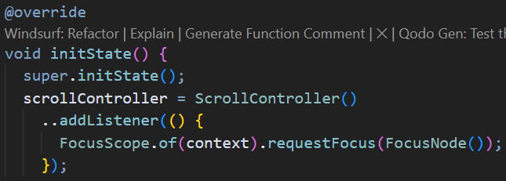

# Dasar Manajemen State di Flutter
> **Mata Kuliah:** Pemrograman Mobile Week 6  
> **Nama:** Nova Diana Ramadhan  
> **Kelas:** SIB 3D  
> **No. Absen:** 19  

---

## 📘 Praktikum 1: Dasar State dengan Model-View

### **Langkah 1: Membuat Project Baru**

---

### **Langkah 2: Membuat model `task.dart`**
Membuat file bernama `task.dart` dan buat `class Task`.

---

### **Langkah 3: Membuat File `plan.dart`**

---

### **Langkah 4: Membuat file `data_layer.dart`**

---

### **Langkah 5: Pindah ke file main.dart**
Mengubah isi kode `main.dart` dengan kode berikut

---

### **Langkah 6: Membuat `plan_screen.dart`**
Membuat file plan_screen.dart pada folder views, kemudian menggunakan template StatefulWidget untuk membuat ClassScreen.

---

### **Langkah 7: Membuat method `_buildAddTaskButton()`**
Menambahkan code berikut di bawah method build di dalam class _PlanScreenState

---

### **Langkah 8: Membuat widget `_buildList()`**
Membuat widget berupa List yang dapat dilakukan scroll

---

### **Langkah 9: Membuat widget `_buildTaskTile`**
Membutuhkan ListTile untuk menampilkan setiap nilai dari plan.tasks

---

### **Langkah 10: Menambahkan Scroll Controller**
Menggunakan ScrollController untuk menghapus focus dari semua TextField selama event scroll dilakukan.

---

### **Langkah 11: Menambahkan Scroll Listener**

---

### **Langkah 12: Menambahkan controller dan keyboard behavior**

---

### **Langkah 13: Menambahkan method dispose()**
method dispose() berguna ketika widget sudah tidak digunakan lagi

---

### **Langkah 14: Hasil**

---
## 🧠 Tugas Praktikum 1: Dasar State dengan Model-View

1. Selesaikan langkah-langkah praktikum tersebut, lalu dokumentasikan berupa GIF hasil akhir praktikum beserta penjelasannya di file README.md! Jika Anda menemukan ada yang error atau tidak berjalan dengan baik, silakan diperbaiki.

---

2. Jelaskan maksud dari langkah 4 pada praktikum tersebut! Mengapa dilakukan demikian?

---

3. Mengapa perlu variabel plan di langkah 6 pada praktikum tersebut? Mengapa dibuat konstanta ?

---

4. Lakukan capture hasil dari Langkah 9 berupa GIF, kemudian jelaskan apa yang telah Anda buat!

---

5. Apa kegunaan method pada Langkah 11 dan 13 dalam lifecyle state ?

---

6. Kumpulkan laporan praktikum Anda berupa link commit atau repository GitHub ke dosen yang telah disepakati !