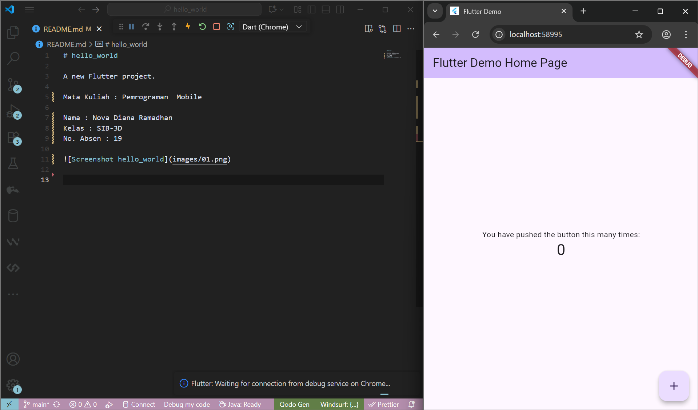
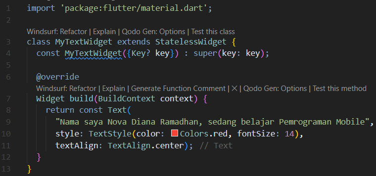
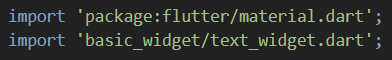
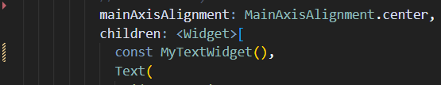
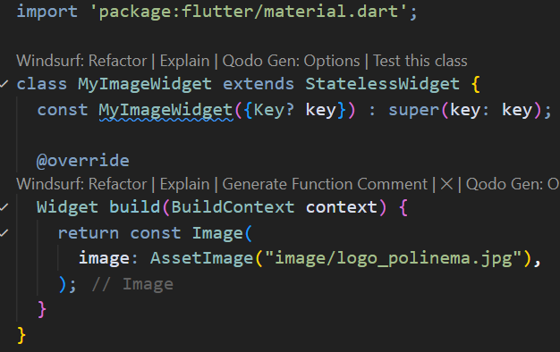
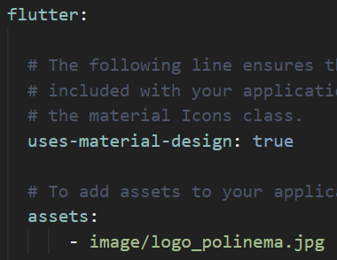
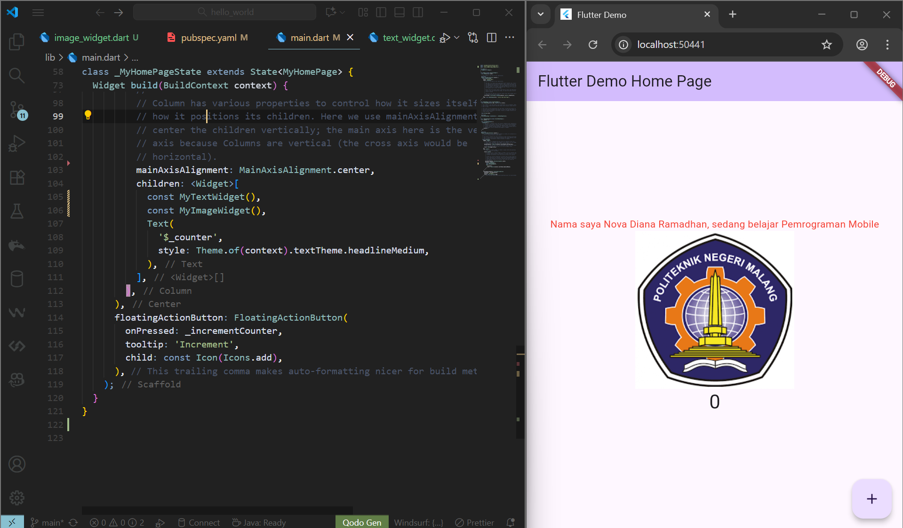

# hello_world

A new Flutter project.

Mata Kuliah : Pemrograman  Mobile

Nama : Nova Diana Ramadhan
Kelas : SIB-3D
No. Absen : 19

Praktikum 4: Menerapkan Widget Dasar

Langkah 1: Text Widget
- membuat folder baru basic_widgets di dalam folder lib. Kemudian buat file baru dengan nama text_Widget.dart

- melakukan import file text_Widget.dat ke main.dart, lalu ganti bagian text widget dengan kode di atas

Langkah 2: Image Widget
- membuat file image_widget.dart di dalam folder basic_widgets

- melakukan penyesuaian asset pada file pubspec.yaml dan menambahkan file logo di folder image project hello_world

- menyesuaikan kode dan import di file main.dart
   

