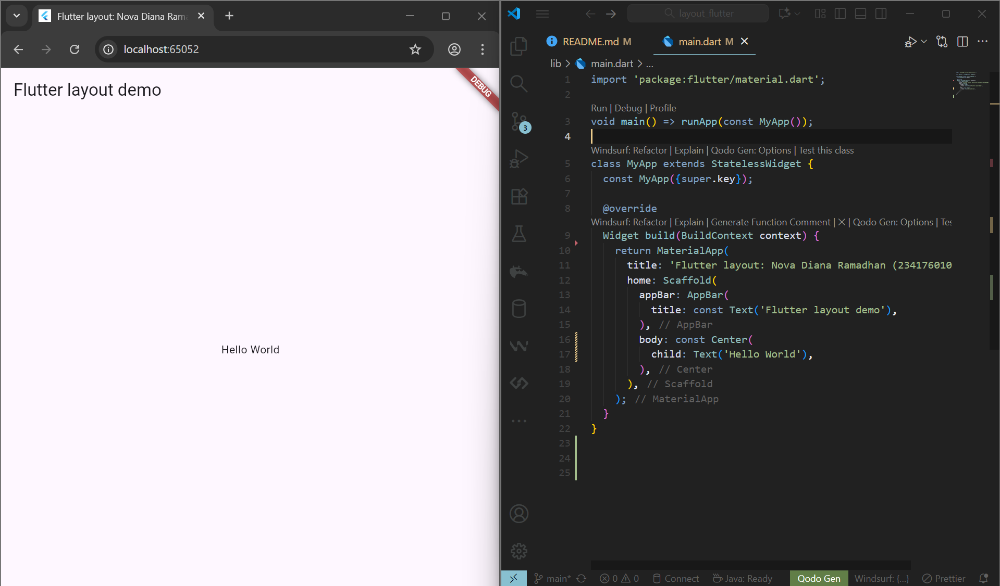

-- PRAKTIKUM 1: MEMBANGUN LAYOUT DI FLUTTER --
Langkah 1: Buat Project Baru
membuat sebuah project flutter baru dengan nama layout_flutter

Langkah 2: Buka file lib/main.dart

Langkah 3: Identifikasi layout diagram

Langkah 4: Implementasi title row
membuat kolom bagian kiri pada judul

-- PRAKTIKUM 2: IMPLEMENTASI BUTTON ROW --
Langkah 1: Buat method Column _buildButtonColumn

Langkah 2: Buat widget buttonSection

Langkah 3: Tambah button section ke body

-- PRAKTIKUM 3: IMPLEMENTASI TEXT SECTION --
Langkah 1: Buat widget textSection
memasukkan teks ke dalam Container dan menambahkan padding di sepanjang setiap tepinya

Langkah 2: Tambah variabel text section ke body

-- PRAKTIKUM 4: IMPLEMENTASI IMAGE SECTION --
Langkah 1: Menyiapkan aset gambar
membuat folder images di root project layout_flutter. Memasukkan file gambar tersebut ke folder images, lalu set nama file tersebut ke file pubspec.yaml

Langkah 2: Tambahkan gambar ke body
menambahkan aset gambar ke dalam body

Langkah 3: Ubah menjadi ListView
semua elemen diatur dalam ListView, bukan Column, karena ListView mendukung scroll yang dinamis saat aplikasi dijalankan pada perangkat yang resolusinya lebih kecil.

