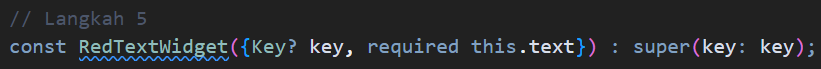
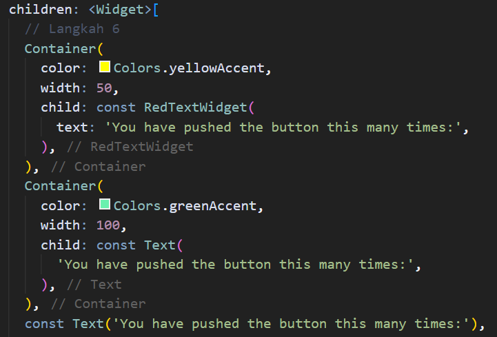
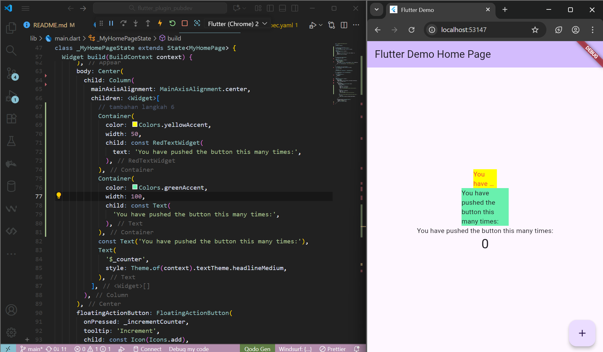

# Manajemen Plugin - Flutter Project

> **Mata Kuliah:** Pemrograman Mobile Week 6  
> **Nama:** Nova Diana Ramadhan  
> **Kelas:** SIB 3D  
> **No. Absen:** 19  

---

## 📘 Praktikum 1

### **Langkah 1: Membuat Project Baru**

---

### **Langkah 2: Menambahkan Plugin**
Menambahkan plugin `auto_size_text`.

---

### **Langkah 3: Membuat File `red_text_widget.dart`**

---

### **Langkah 4: Tambah Widget `AutoSizeText`**

**Terjadi error karena:**
1. Widget `AutoSizeText` belum di-*import*, sehingga Flutter tidak mengenali widget tersebut karena berasal dari package eksternal `auto_size_text`.
2. Variabel `text` belum dideklarasikan, padahal sudah dipanggil. Kelas `RedTextWidget` tidak memiliki parameter bernama `text`, sehingga Flutter tidak tahu nilai apa yang harus ditampilkan.

**Solusi:**  
Mengatasi error dengan mengubah kode menjadi seperti berikut:

---

### **Langkah 5: Buat Variabel `text` dan Parameter di Constructor**

---

### **Langkah 6: Menambahkan Widget di `main.dart`**

**Hasil setelah dijalankan:**

---

## 🧠 Tugas Praktikum

1. **Selesaikan praktikum tersebut**, lalu dokumentasikan dan *push* ke repository Anda berupa screenshot hasil pekerjaan beserta penjelasannya di file `README.md`.

---

2. **Jelaskan maksud dari langkah 2 pada praktikum tersebut!**  
   **Jawab:**  
   Langkah ke-2 bertujuan untuk menambahkan plugin eksternal bernama `auto_size_text` pada aplikasi Flutter ini. Plugin ini digunakan untuk membuat teks yang dapat menyesuaikan ukurannya dengan ukuran layar perangkat yang digunakan. Dengan menggunakan plugin ini, teks yang ditampilkan pada aplikasi akan lebih mudah dibaca dan lebih menarik bagi pengguna.

---

3. **Jelaskan maksud dari langkah 5 pada praktikum tersebut!**  
   **Jawab:**  
   Langkah ke-5 bertujuan untuk membuat variabel `text` dan parameter di *constructor*. Variabel `text` digunakan untuk menyimpan teks yang akan ditampilkan pada aplikasi, sedangkan parameter di *constructor* digunakan untuk mengatur nilai awal dari variabel `text`. Dengan menggunakan parameter di *constructor*, kita dapat mengatur nilai awal dari variabel `text` saat objek dari kelas ini dibuat.

---

4. **Pada langkah 6 terdapat dua widget yang ditambahkan, jelaskan fungsi dan perbedaannya!**  
   **Jawab:**  
   Dua *container* tersebut memiliki fungsi yang sama yaitu sebagai wadah tampilan, namun berbeda dalam isi dan tampilannya:
   - **Container kuning:** berisi `RedTextWidget`, yaitu widget kustom yang menampilkan teks berwarna merah.
   - **Container hijau:** berisi `Text`, yaitu widget bawaan Flutter untuk menampilkan teks biasa.

---

5. **Jelaskan maksud dari tiap parameter yang ada di dalam plugin `auto_size_text` berdasarkan dokumentasi!**
   - **text:** Teks yang akan ditampilkan pada widget.
   - **style:** Mengatur tampilan teks seperti warna, ukuran font, ketebalan, dan lainnya.
   - **maxLines:** Jumlah maksimal baris teks yang dapat ditampilkan pada widget. Jika teks melebihi jumlah baris ini, maka akan dipotong dan ditambahkan tanda “...” di akhir.
   - **overflow:** Menentukan tindakan ketika teks melebihi batas baris `maxLines`. Nilai yang dapat digunakan antara lain `TextOverflow.clip`, `TextOverflow.ellipsis`, atau `TextOverflow.fade`.

---

6. **Kumpulkan laporan praktikum Anda berupa link repository GitHub kepada dosen!**
