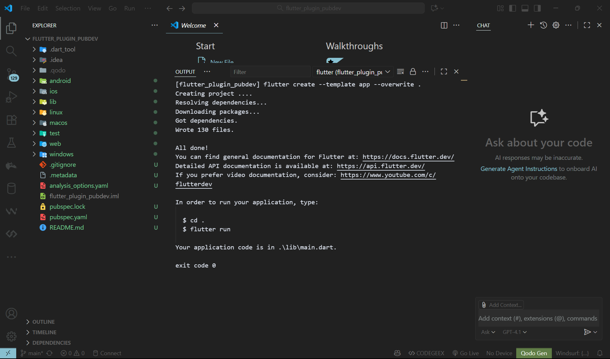
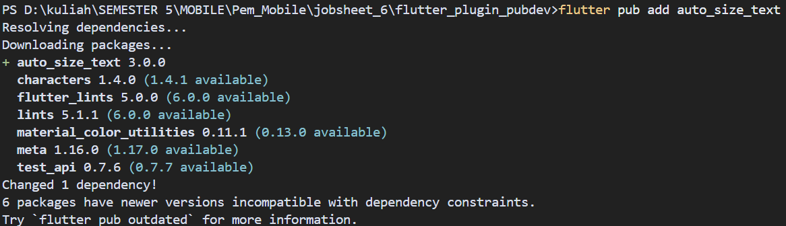
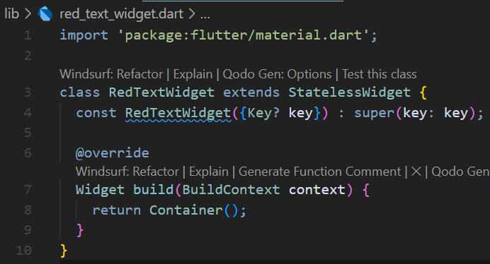
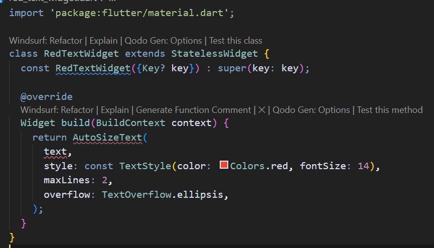
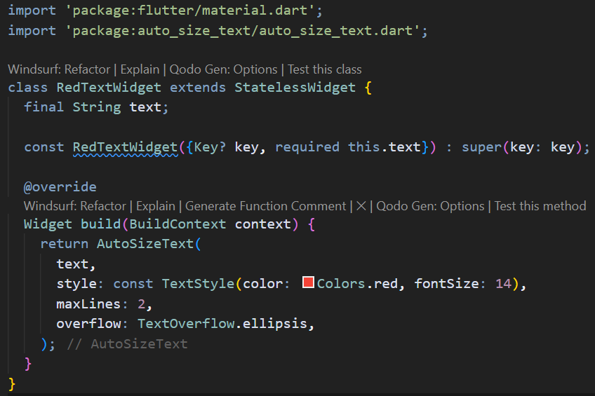

# Manajemen Plugin - Flutter Project

A new Flutter project.

Mata Kuliah : Pemrograman Mobile Week 6

Nama       : Nova Diana Ramadhan
Kelas      : SIB 3D  
No Absen   : 19

---

## Praktikum 1
**Langkah 1: Membuat project baru**

**Langkah 2: Menambahkan Plugin**
Menambahkan plugin auto_size_text

**Langkah 3: Membuat file red_text_widget.dart**

**Langkah 4: Tambah Widget AutoSizeText**

Terjadi error karena:
1. Widget AutoSizeText belum diimport sehingga flutter tidak mengenali widget tersebut karena berasal dari package external auto_size_text
2. Variable text belum dideklarasikan sedangkan sudah memanggil text, tetapi kelas RedTextWidget tidak memiliki parameter bernama text, sehingga flutter tidak tahu nilai apa yang harus ditampilkan

Mengatasi error dengan mengubah kode menjadi seperti berikut:

---